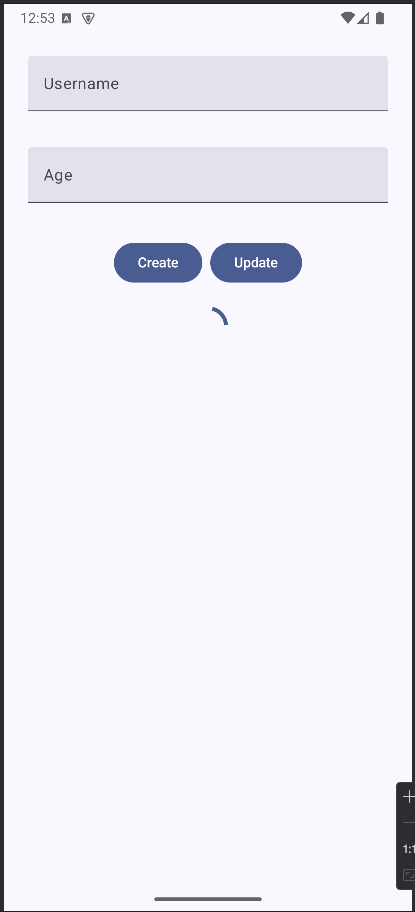
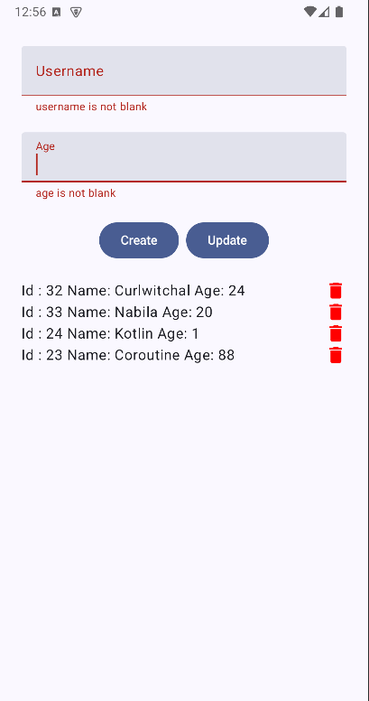

# Simple MVVM Android Architecture With Koin DI
## Features

## Depedency
Depedencies that are used:

- insert-koin.io - Dependency Injection!
   
### Installation

1. Clone the repo
   ```sh
   git clone https://github.com/curlwithchal/Basic-MVVM-Android-Compose-With-Koin.git
   ```

## Thank You
**don't forget the star ✨**

